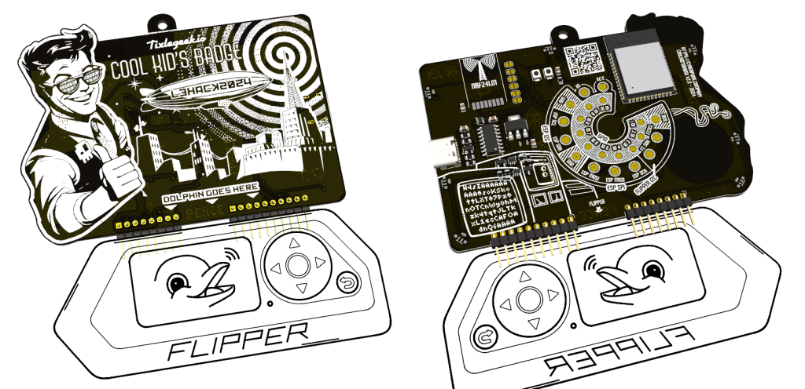

# CoolKidsBadge (2024)

> [!IMPORTANT]
>
> This README is a **work in progress**. Come back later to be sure it's up to date 😀

The **CoolKid'sBadge** is a convention electronic badge created for the [LeHack2024](https://lehack.org/fr/) Cyber-security convention in Paris(Fr) (not affiliated), containing an ESP32S3 with 16Mb Flash, a NRF24L01 Slot, and a FlipperZero interface.

## History

This project started by 2023, but could not be ready in time for LeHack2023. So the project continued live on twitch at https://twitch.tv/tixlegeek

## Compiling

The ESP32S3 firmware needs to be compiled using espressif's **ESP-IDF v5.2** and higher.

## Hardware

> [!NOTE]
>
> The Schematics will soon be available ❤️

## Tools

## AUTHOR

@tixlegeek [tixlegeek@cyberpunk.company](mailto:tixlegeek@cyberpunk.company)

## SEE ALSO

[My Blog](https://tixlegeek.io) - [More](https://tixlegeek.io/splash) - [Twitch](https://twitch.tv/tixlegeek) - [X/Twitter](https://x.com/tixlegeek)

[Cyberpunk.company](https://cyberpunk.company)