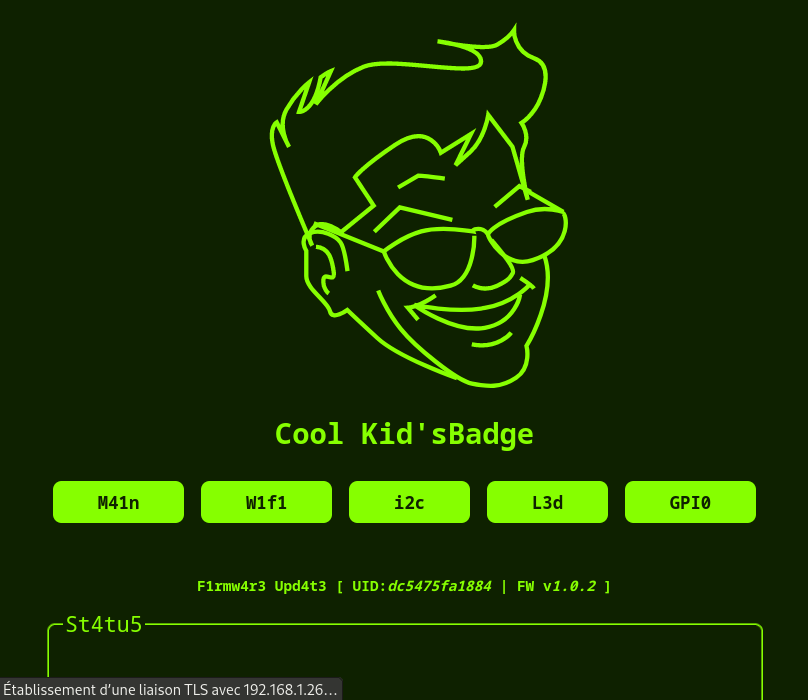

# CoolKidsBadge (2024)

> [!IMPORTANT]
>
> This README is a **work in progress**. Come back later to be sure it's up to date 😀

The **CoolKid'sBadge** is a convention electronic badge created for the [LeHack2024](https://lehack.org/fr/) Cyber-security convention in Paris(Fr) (not affiliated), containing an **ESP32S3** with 16Mb Flash, a **NRF24L01** Slot, a **FlipperZero** interface, 7 **LEDs** and some pads. It can be powered directly from the **GPIO** Port of the FlipperZero, or via the **USB C** Connector.

## History

This project started by 2023, but could not be ready in time for LeHack2023. So the project continued live on twitch at https://twitch.tv/tixlegeek

## Compiling

The ESP32S3 firmware needs to be compiled using espressif's **ESP-IDF v5.2** and higher.

## Using the badge

First, connect the power supply, either the FlipperZero with 5V GPIO enabled, or using the USB C Port.

You should be able to connect to the CoolKid'sBadge using the procedural password you got, or generated using the [dedicated script.](https://github.com/tixlegeek/CoolKidsBadge-2024/tree/main/fw/scripts/wifiPassword)

Once connected, navigate to https://192.168.4.1 to start using your Badge like a Cool Kid you are 😎

## Hardware

> [!NOTE]
>
> The PCB is not shared as it's specific to LeHack2024 🏴‍☠️

All the hardware have been created using [Kicad](https://github.com/KiCad) ❤️. Everything should be available inside the [Cyberpunk.Company's submoduled Kicad Library](https://github.com/Cyberpunk-company/CBRPNKCIE-Kicad-lib).

## Tools

The **CoolKid'sBadge** comes with a lot of little tools aimed towards Prototyping, Reverse engineering... But it's still a conference badge :)

- **WiFi Configuration:**

  - **STA**
  - **AP** (always ON, enabling Configuration)

- **i2C Tools**

  The embedded I2C Tool allows you to scan devices. It also allows you to write and read registers from any I2C components.

- **LED configurator**

  LED animation can be chosen using the embedded tool, in the LED menu.

- **GPIO**

  There's 10 GPIO Pads on the rear of the badge, that can be monitored and controlled using the GPIO Tool.

## AUTHOR

@tixlegeek [tixlegeek@cyberpunk.company](mailto:tixlegeek@cyberpunk.company)

## SEE ALSO

[My Blog](https://tixlegeek.io) - [More](https://tixlegeek.io/splash) - [Twitch](https://twitch.tv/tixlegeek) - [X/Twitter](https://x.com/tixlegeek)

[Cyberpunk.company](https://cyberpunk.company)